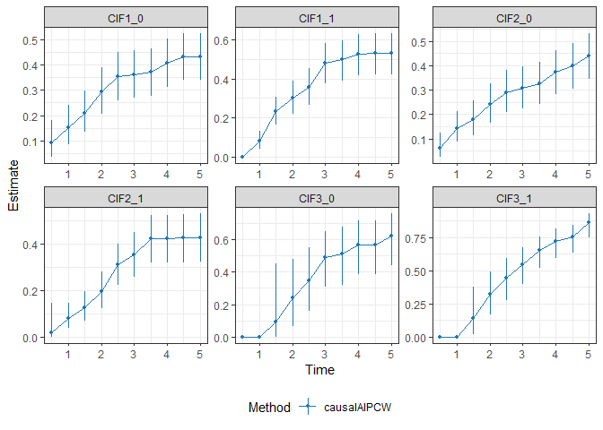

# causalDR

<!-- badges: start -->

<!-- badges: end -->

## Overview

`causalDR` is an R package for **doubly robust causal inference with
semi-competing risks under covariate-dependent censoring**.
Semi-competing risks occur when individuals may experience a
non-terminal (e.g., illness) and a terminal event (e.g., death), where
the terminal event censors the non-terminal event but not vice versa.
The package provides augmented inverse probability weighting (AIPW)
estimators that jointly adjust for censoring and treatment assignment.

The resulting estimators involve two sets of nuisance models:

- `time_model`: models for the non-terminal event time and the terminal
  event time,

- `censor_model` and `PS_model`: models for censoring time and
  propensity score (PS).

The estimators are doubly robust (DR) in the following two senses:

- *model DR*: consistency and asymptotic normality (CAN) if either set
  of the nuisance models is correctly specified and both sets of
  nuisance estimators are asymptotically linear (e.g., when parametric
  or semiparametric models are used).

- *rate DR*: CAN when both sets of the models converge to the truth but
  at possibly slower than root-$`n`$ (e.g., when nonparametric machine
  learning methods are used), as long as their product rate is faster
  than root-$`n`$,

Supported causal estimands include treatment-specific cumulative
incidence functions (CIFs) for key event types:

- `CIF1`: risk for the non-terminal event,

- `CIF2`: risk for the terminal event without prior non-terminal event,

- `CIF3`: risk for the terminal event following the non-terminal event

The package also provides estimates for the treatment effect, which are
defined as contrasts of above risk quantities between treatment groups
(e.g, risk difference and ratio). Bootstrap is used for standard errors
and confidence intervals.

The package supports flexible estimation of nuisance parameters using
**parametric, semi-parametric, and machine learning methods**, including
Cox models, random forests, boosting, and spline-based approaches, with
optional **cross-fitting** to mitigate overfitting bias.

The methods implemented in this package correspond to the methodology
developed in Qin et al. (2026+).

## Installation

You can install the development version of causalDR from
[GitHub](https://github.com/JiyueQin/causalDR) with:

``` r
# install.packages("pak")
pak::pak("JiyueQin/causalDR")
```

## Example

This is a basic example with some simulated data.

``` r
library(causalDR)
# set seed for reproducibility 
set.seed(1)
# simulate a sample of size 200
dat = sim_data(n=200)
head(dat)
#> # A tibble: 6 × 9
#>      id     A     X1     X2 delta1 delta2      Z1      Z2 event_type            
#>   <int> <int>  <dbl>  <dbl>  <dbl>  <dbl>   <dbl>   <dbl> <chr>                 
#> 1     1     1 0.0227 0.0227      0      0 -0.234  -0.232  0.censored before ill…
#> 2     2     0 3.80   3.80        0      1 -0.128  -0.281  2.death without illne…
#> 3     3     0 1.39   4.69        1      1  0.0729  0.0168 3.illness then death  
#> 4     4     0 0.277  0.277       0      0  0.408  -0.231  0.censored before ill…
#> 5     5     1 2.83   5.01        1      1 -0.298  -0.319  3.illness then death  
#> # ℹ 1 more row
```

``` r
# Estimate all three CIFs at a user-specified grid of times
# without computing SEs
fit1 <- causalAIPCW(data = dat, covars = c("Z1", "Z2"), 
                    time_interest = seq(0.5, 5, by = 0.5),
                    time_model = 'RSF',censor_model = 'Cox', PS_model = 'logit',
                    time1_interest = 1, n_boot = 0)
#> Crossfitting fold: 1 Censor model: Cox 
#> Crossfitting fold: 1 Time model: RSF 
#> Crossfitting fold: 1 PS Model: logit 
#> Crossfitting fold: 2 Censor model: Cox 
#> Crossfitting fold: 2 Time model: RSF 
#> Crossfitting fold: 2 PS Model: logit 
#> Crossfitting fold: 3 Censor model: Cox 
#> Crossfitting fold: 3 Time model: RSF 
#> Crossfitting fold: 3 PS Model: logit 
#> Crossfitting fold: 4 Censor model: Cox 
#> Crossfitting fold: 4 Time model: RSF 
#> Crossfitting fold: 4 PS Model: logit 
#> Crossfitting fold: 5 Censor model: Cox 
#> Crossfitting fold: 5 Time model: RSF 
#> Crossfitting fold: 5 PS Model: logit
# point estimates 
knitr::kable(fit1$est, digits = 3)
```

| est_CIF1_0 | est_CIF1_1 | est_CIF2_0 | est_CIF2_1 | est_CIF3_0 | est_CIF3_1 |
|-----------:|-----------:|-----------:|-----------:|-----------:|-----------:|
|      0.085 |      0.001 |      0.065 |      0.022 |      0.000 |      0.000 |
|      0.145 |      0.088 |      0.142 |      0.087 |      0.000 |      0.000 |
|      0.209 |      0.235 |      0.178 |      0.131 |      0.101 |      0.162 |
|      0.298 |      0.302 |      0.241 |      0.201 |      0.237 |      0.338 |
|      0.354 |      0.360 |      0.295 |      0.310 |      0.323 |      0.430 |
|      0.364 |      0.489 |      0.315 |      0.348 |      0.491 |      0.541 |
|      0.372 |      0.510 |      0.331 |      0.417 |      0.513 |      0.649 |
|      0.408 |      0.539 |      0.377 |      0.421 |      0.570 |      0.722 |
|      0.433 |      0.539 |      0.401 |      0.421 |      0.570 |      0.763 |
|      0.433 |      0.539 |      0.443 |      0.421 |      0.615 |      0.852 |

``` r
# Estimate all three CIFs and compute SEs by bootstrap
# with default nuisance models
# the command may take a few minutes to execute 
fit2 <- causalAIPCW(data = dat, covars = c("Z1", "Z2"), 
                    time_interest = seq(0.5, 5, by = 0.5),
                    time1_interest = 1, n_boot = 100, seed = 1)
```

``` r
# points estimates and SEs for the last time point(i.e, t = 5)
knitr::kable(tail(fit2$est_se), digits = 3)
```

| time | estimand |   est |    se | lower | upper |
|-----:|:---------|------:|------:|------:|------:|
|    5 | CIF1_0   | 0.434 | 0.048 | 0.339 | 0.525 |
|    5 | CIF1_1   | 0.531 | 0.054 | 0.419 | 0.630 |
|    5 | CIF2_0   | 0.440 | 0.048 | 0.345 | 0.531 |
|    5 | CIF2_1   | 0.427 | 0.053 | 0.320 | 0.528 |
|    5 | CIF3_0   | 0.623 | 0.081 | 0.443 | 0.759 |
|    5 | CIF3_1   | 0.864 | 0.042 | 0.746 | 0.930 |

``` r
# plot the estimated CIFs with 95% CIs
plot_estimates(fit2)
```



## Citation

To appear.

## Contact

Maintained by **Jiyue Qin**,

PhD Candidate in Biostatistics, University of California San Diego,

<j5qin@ucsd.edu>
